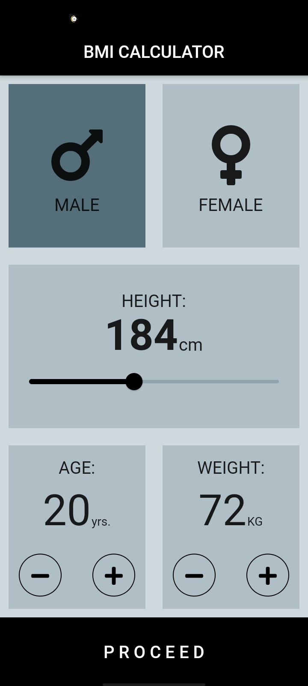
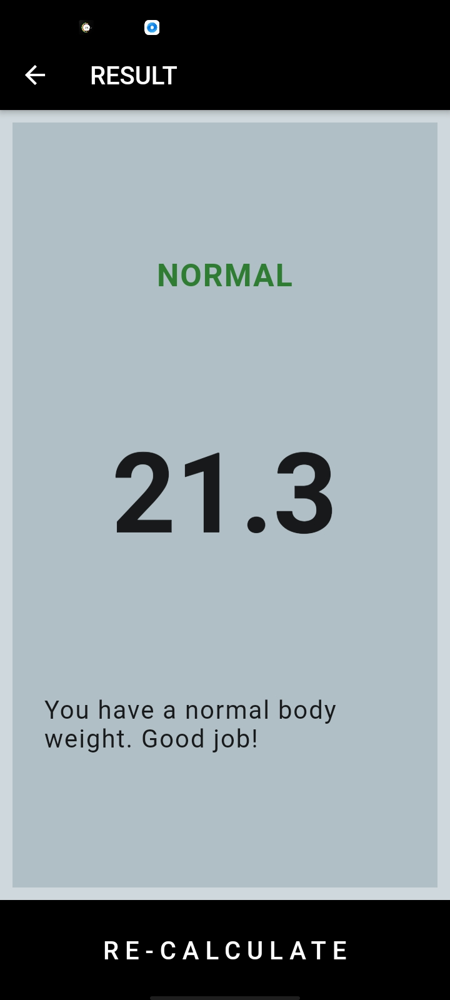

# Body Mass Index Calculator

This flutter application, makes use of the material library to create the User Interface for the mobile application. The application basically takes the required inputs from the user, and after calculating the BMI, using the appropiate formula, displays it onto the next screen.

## Snapshots of the created application, are attached below.

&nbsp;&nbsp;&nbsp;&nbsp;&nbsp;&nbsp;&nbsp;&nbsp;&nbsp;&nbsp;
